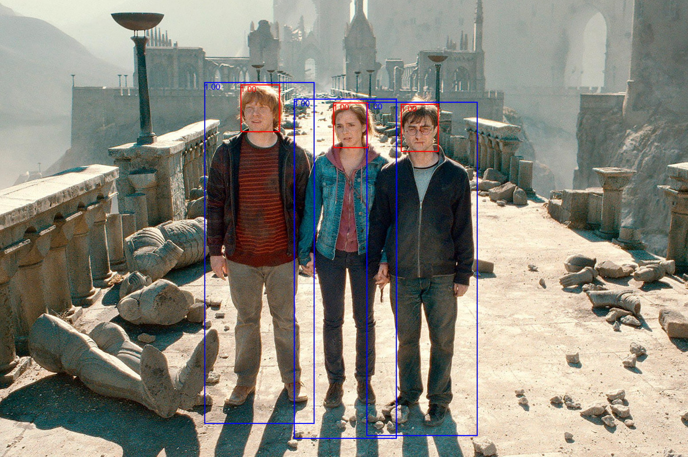

# Running Inference on a New Image with the Pre-trained Model

<div align="center">
    
</div>

Welcome to this repository! If you're eager to test the pre-trained model on your own image, follow the steps below:

## Prerequisites:

1. Ensure you have a Python environment with the necessary libraries installed. You can install them by using the following command:

    - `matplotlib==3.6.2`: A library for creating static, animated, and interactive visualizations in Python.
    - `numpy==1.23.4`: A library used for mathematical operations and handling arrays in Python.
    - `Pillow==10.0.0`: A library that adds support for opening, manipulating, and saving many different formats of image files.
    - `scikit-learn==1.1.3`: A machine learning library in Python, built on NumPy, SciPy, and matplotlib.
    - `torch==1.13.0`: An open-source machine learning library, a scientific computing framework, and a script language based on Python.
    - `torchvision==0.14.0`: A package that provides datasets, models, and transforms for computer vision.
    - `tqdm==4.64.1`: A library to display progress bars in Python.
   
    ```bash
    pip install -r requirements.txt
    ```

2. While not compulsory, a CUDA-capable GPU is recommended for faster inference. Without a GPU, the code will default to running on the CPU which will be slower.

<!--3. Download the weights for `fasterrcnn_resnet50_fpn` model from https://shorturl.at/hvHPW 

4. Rename downloaded weights file to `fasterrcnn_resnet50_fpn_coco.pth` and place the it in the same folder with `inference.py` -->

3. Download the `model_weights_final.pth` for fine-tuned model from https://shorturl.at/eJTU6, which contains the model's trained weights.

4. Place downloaded `model_weights_final.pth` in the same folder with `inference.py` 

## Instructions:

1. **Clone the Repository**:
    ```bash
    git clone https://github.com/vedernikovphoto/Faster_RCNN
    cd [YOUR_REPOSITORY_DIRECTORY]
    ```

2. **Prepare Your Image**:
    - If it doesn't exist, create an `Inference` folder in the root directory of the cloned repository.
    - Place your desired image inside this `Inference` folder. For this guide, we'll refer to this image as `test.jpg`.

3. **Run the Script**:
    ```bash
    python inference.py
    ```

4. **View Results**:
    Post execution, the image will be displayed with red outlined bounding boxes around detected objects.

Thank you for using this model! Feel free to raise any issues or contribute.


